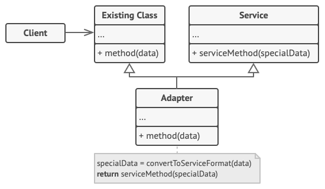

## Adapter Pattern

Adapter is a structural design pattern that allows objects with incompatible interfaces to collaborate.

## Problem

Imagine that you’re creating a stock market monitoring app. The app downloads the stock data from multiple sources in XML format and then displays nice-looking charts and diagrams for the user.

At some point, you decide to improve the app by integrating a smart 3rd-party analytics library. But there’s a catch: the analytics library only works with data in JSON format.


## Solution

You can create an adapter. This is a special object that converts the interface of one object so that another object can understand it.

An adapter wraps one of the objects to hide the complexity of conversion happening behind the scenes. The wrapped object isn’t even aware of the adapter. For example, you can wrap an object that operates in meters and kilometers with an adapter that converts all of the data to imperial units such as feet and miles.

Adapters can not only convert data into various formats but can also help objects with different interfaces collaborate. Here’s how it works:

1. The adapter gets an interface, compatible with one of the existing objects.
2. Using this interface, the existing object can safely call the adapter’s methods.
3. Upon receiving a call, the adapter passes the request to the second object, but in a format and order that the second object expects.

> Sometimes it’s even possible to create a two-way adapter that can convert the calls in both directions.


## Structure

### Object adapter

This implementation uses the object composition principle: the adapter implements the interface of one object and wraps the other one. It can be implemented in all popular programming languages.


1. The Client is a class that contains the existing business logic of the program.
2. The Client Interface describes a protocol that other classes must follow to be able to collaborate with the client code.
3. The Service is some useful class (usually 3rd-party or legacy). The client can’t use this class directly because it has an incompatible interface.
4. The Adapter is a class that’s able to work with both the client and the service: it implements the client interface, while wrapping the service object. The adapter receives calls from the client via the client interface and translates them into calls to the wrapped service object in a format it can understand.
5. The client code doesn’t get coupled to the concrete adapter class as long as it works with the adapter via the client interface. Thanks to this, you can introduce new types of adapters into the program without breaking the existing client code. This can be useful when the interface of the service class gets changed or replaced: you can just create a new adapter class without changing the client code.

### Class adapter

This implementation uses inheritance: the adapter inherits interfaces from both objects at the same time. Note that this approach can only be implemented in programming languages that support multiple inheritance, such as C++.



1. The Class Adapter doesn’t need to wrap any objects because it inherits behaviors from both the client and the service. The adaptation happens within the overridden methods. The resulting adapter can be used in place of an existing client class.

## Example

We have a client code that expects some features of an object (Lightning port), but we have another object called adaptee (Windows laptop) which offers the same functionality but through a different interface (USB port)

This is where the Adapter pattern comes into the picture. We create a struct type known as adapter that will:

- Adhere to the same interface which the client expects (Lightning port).

- Translate the request from the client to the adaptee in the form that the adaptee expects. The adapter accepts a Lightning connector and then translates its signals into a USB format and passes them to the USB port in windows laptop.

### client code

```go
package main

import "fmt"

type Client struct {
}

func (c *Client) InsertLightningConnectorIntoComputer(com Computer) {
    fmt.Println("Client inserts Lightning connector into computer.")
    com.InsertIntoLightningPort()
}
```

### Clint interface

```go
package main

type Computer interface {
    InsertIntoLightningPort()
}
```

### Service

```go
package main

import "fmt"

type Mac struct {
}

func (m *Mac) InsertIntoLightningPort() {
    fmt.Println("Lightning connector is plugged into mac machine.")
}
```

### Unknown service

```go
package main

import "fmt"

type Windows struct{}

func (w *Windows) insertIntoUSBPort() {
    fmt.Println("USB connector is plugged into windows machine.")
}
```

### Adapter

```go
package main

import "fmt"

type WindowsAdapter struct {
    windowMachine *Windows
}

func (w *WindowsAdapter) InsertIntoLightningPort() {
    fmt.Println("Adapter converts Lightning signal to USB.")
    w.windowMachine.insertIntoUSBPort()
}
```

### main

```go
package main

func main() {

    client := &Client{}
    mac := &Mac{}

    client.InsertLightningConnectorIntoComputer(mac)

    windowsMachine := &Windows{}
    windowsMachineAdapter := &WindowsAdapter{
        windowMachine: windowsMachine,
    }

    client.InsertLightningConnectorIntoComputer(windowsMachineAdapter)
}
```

Execution result:

```plaintext
Client inserts Lightning connector into computer.
Lightning connector is plugged into mac machine.
Client inserts Lightning connector into computer.
Adapter converts Lightning signal to USB.
USB connector is plugged into windows machine.
```

## Pros

- Single Responsibility Principle. You can separate the interface or data conversion code from the primary business logic of the program.
- Open/Closed Principle. You can introduce new types of adapters into the program without breaking the existing client code, as long as they work with the adapters through the client interface.

## Cons

- The overall complexity of the code increases because you need to introduce a set of new interfaces and classes. Sometimes it’s simpler just to change the service class so that it matches the rest of your code.

## References

- https://refactoring.guru/design-patterns/adapter
