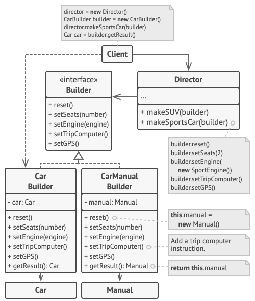

## Builder Pattern

The Builder Pattern is a creational design pattern that provides an abstraction over object construction. Instead of directly constructing an object with a large number of constructor arguments, the pattern splits the construction process into multiple smaller steps. Each step is handled by a separate builder, which allows for greater flexibility and configurability.

## Key Components

- **Product**: Represents the complex object being built.
- **Builder**: Provides an interface for constructing the parts of the product.
- **Concrete Builder**: Implements the builder interface and constructs the parts of the product.
- **Director**: Orchestrates the construction process by using the builder interface.

## Example

The following example demonstrates how to use the Builder Pattern in Go to construct a Car object.



```go
package main

// Car represents the complex object being built.
type Car struct {
    color         string
    engineType    string
    hasSunroof    bool
    hasNavigation bool
}

// CarBuilder provides an interface for constructing the parts of the car.
type CarBuilder interface {
    SetColor(color string) CarBuilder
    SetEngineType(engineType string) CarBuilder
    SetSunroof(hasSunroof bool) CarBuilder
    SetNavigation(hasNavigation bool) CarBuilder
    Build() *Car
}

// NewCarBuilder creates a new CarBuilder.
func NewCarBuilder() CarBuilder {
    return &carBuilder{
        car: &Car{}, // Initialize the car attribute
    }
}

// carBuilder implements the CarBuilder interface.
type carBuilder struct {
    car *Car
}

func (cb *carBuilder) SetColor(color string) CarBuilder {
    cb.car.color = color
    return cb
}

func (cb *carBuilder) SetEngineType(engineType string) CarBuilder {
    cb.car.engineType = engineType
    return cb
}

func (cb *carBuilder) SetSunroof(hasSunroof bool) CarBuilder {
    cb.car.hasSunroof = hasSunroof
    return cb
}

func (cb *carBuilder) SetNavigation(hasNavigation bool) CarBuilder {
    cb.car.hasNavigation = hasNavigation
    return cb
}

func (cb *carBuilder) Build() *Car {
    return cb.car
}

// Director provides an interface to build cars.
type Director struct {
    builder CarBuilder
}

func (d *Director) ConstructCar(color, engineType string, hasSunroof, hasNavigation bool) *Car {
    d.builder.SetColor(color).
        SetEngineType(engineType).
        SetSunroof(hasSunroof).
        SetNavigation(hasNavigation)

    return d.builder.Build()
}

func main() {
    // Create a new car builder.
    builder := NewCarBuilder()

    // Create a car with the director.
    director := &Director{builder: builder}
    myCar := director.ConstructCar("blue", "electric", true, true)

    // Use the car object with the chosen configuration.
    // ...
}
```

## pros

- ✅ Improved readability: The construction process is broken into logical steps.
- ✅ Flexibility: Easily create different representations of an object.
- ✅ Separation of concerns: Keeps the construction logic separate from the object’s structure.
- ✅ Optional parameters: Avoids telescoping constructors or large parameter lists.

## cons

- ❌ Increased complexity: More classes/interfaces required compared to simple constructors.
- ❌ Overhead for simple objects: Might be overkill for objects with only a few fields.
- ❌ Immutability: Objects built via mutable builders may not be thread-safe unless explicitly handled.

## references

- [understanding the builder pattern in go](https://dev.to/kittipat1413/understanding-the-builder-pattern-in-go-gp9)
- [refactoring builder pattern](https://refactoring.guru/design-patterns/builder)
