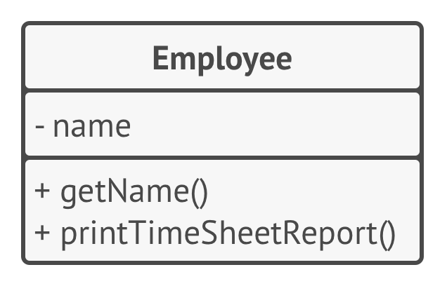
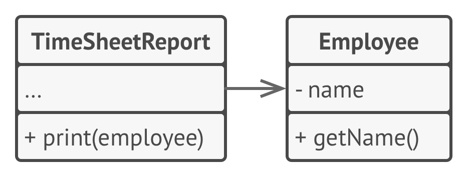
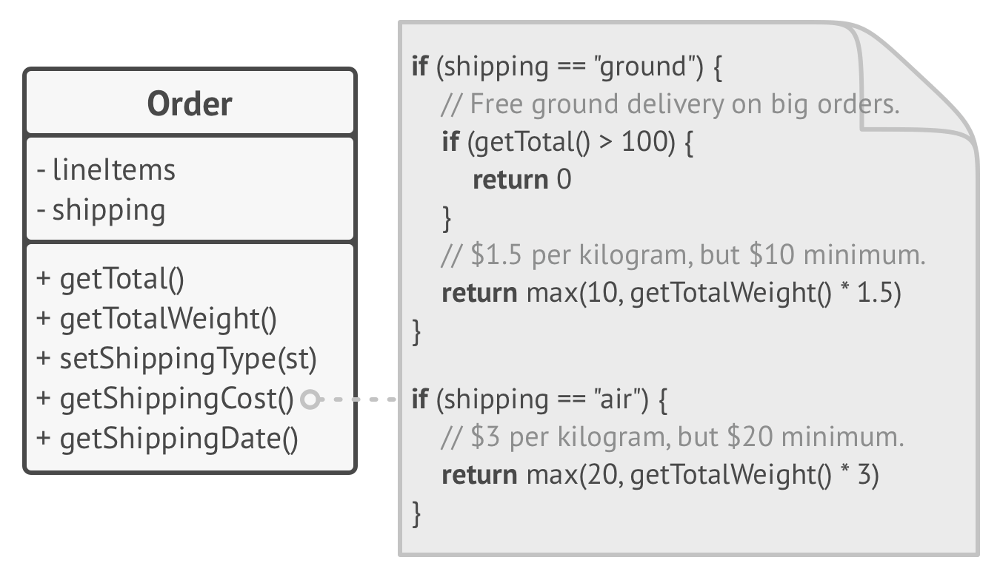
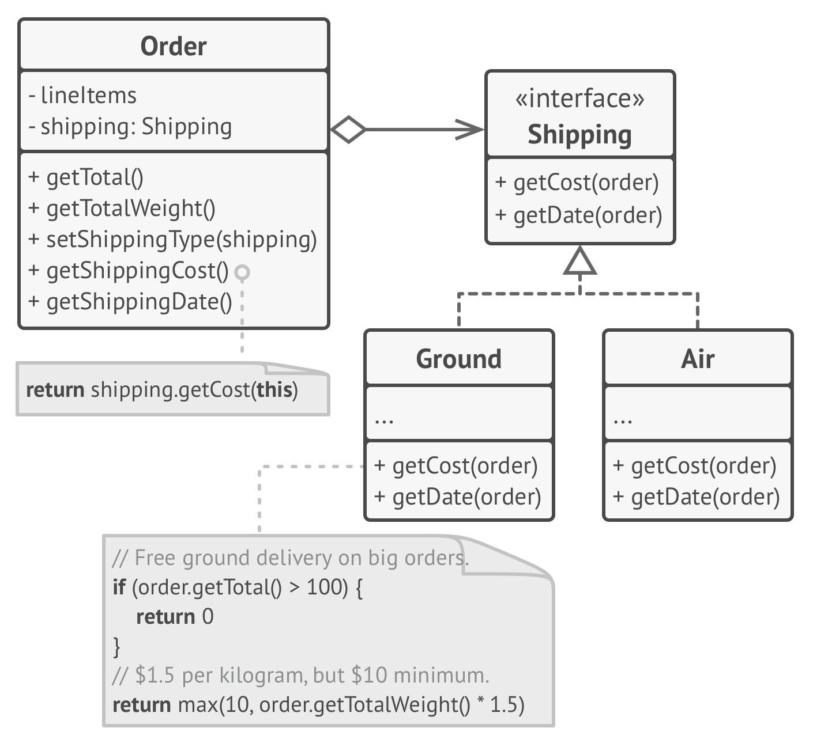
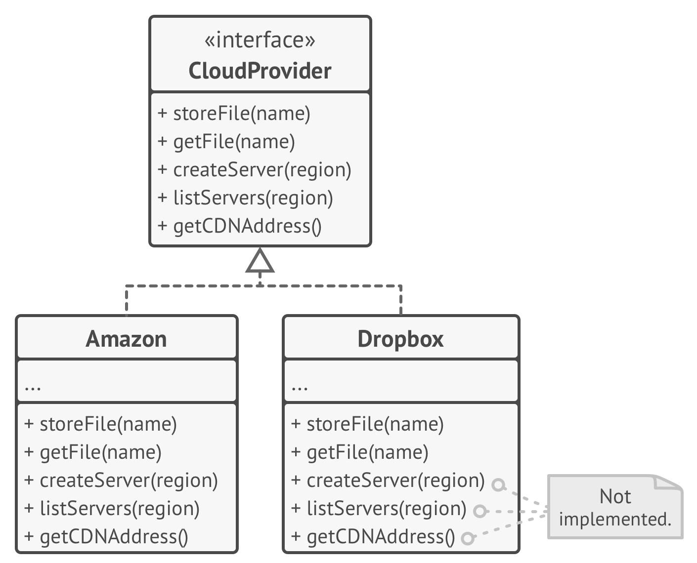
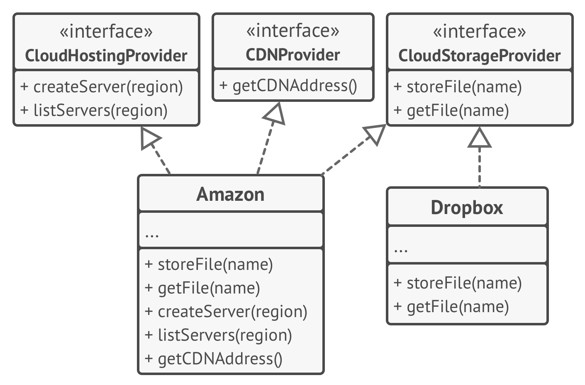
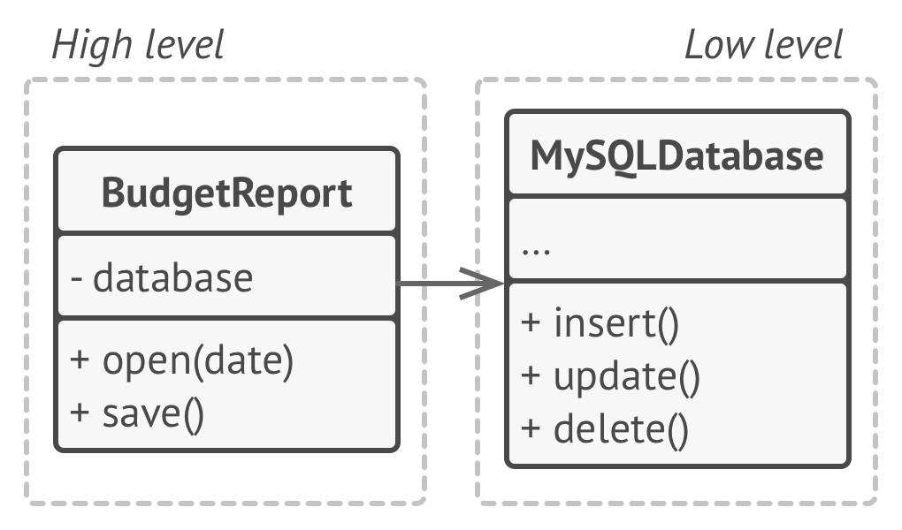
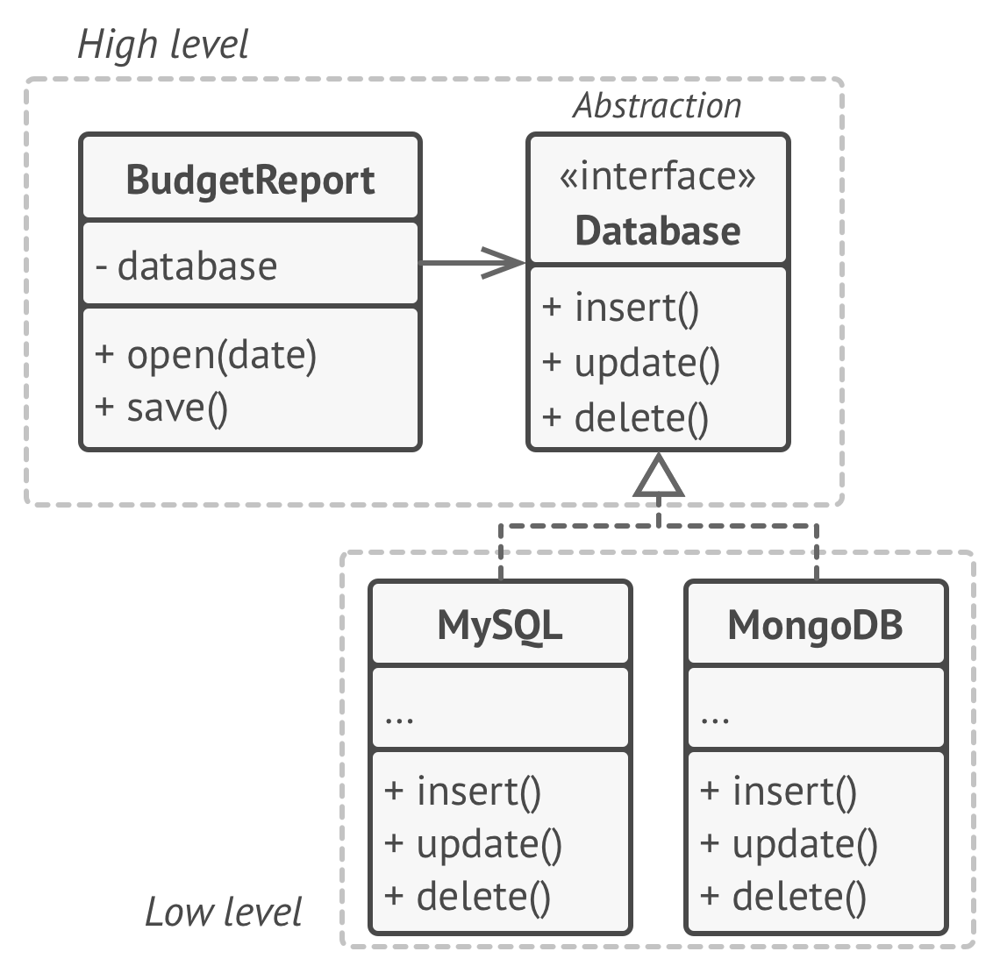

# SOLID Principles

SOLID is a set of five foundational principles of object-oriented design and architecture. Applying these principles helps make software more **maintainable**, **scalable**, and **testable**.

---

## 1. Single Responsibility Principle (SRP)

**Definition:**  
A class should have only one reason to change.

**Goal:**  
Reduce complexity by ensuring each class focuses on a single responsibility.

**Example:**

**before SRP:**  


**after SRP:**  


**Golang**

```go
// ❌ Violates SRP: handles both user data and file saving
type Employee struct {
	name string
}

func (e *Employee) GetName() string       { return e.name }
func (e *Employee) PrintTimeSheetReport() {}
```

```go
// ✅ Follows SRP: separates user data from persistence logic
type Employee struct {
	name string
}

func (e *Employee) GetName() string { return e.name }

type TimeSheetReport struct{}

func (t *TimeSheetReport) PrintTimeSheetReport(e *Employee) {}
```

**Python**

```python
# ❌ Violates SRP: handles both user data and file saving
class User:
    def __init__(self, name):
        self.name = name

    def save_to_file(self):
        with open("user.txt", "w") as f:
            f.write(self.name)

# ✅ Follows SRP: separates user data from persistence logic
class User:
    def __init__(self, name):
        self.name = name

class UserSaver:
    def save_to_file(self, user: User):
        with open("user.txt", "w") as f:
            f.write(user.name)
```

---

## 2. Open/Closed Principle (OCP)

**Definition:**  
Classes should be **open for extension** but **closed for modification**.

**Goal:**  
Allow new features to be added without changing existing code, reducing the risk of breaking functionality.

**Description:**  
If a class is already developed, tested, reviewed, and included in some framework or otherwise used in an app, trying to mess with its code is risky. Instead of changing the code of the class directly, you can create a subclass and override parts of the original class that you want to behave differently. You’ll achieve your goal but also won’t break any existing clients of the original class.

> **Note:**  
> This principle is not meant for all changes. If there’s a bug, fix it directly. Don’t create a subclass to fix parent issues.

**Example:**  
You have an e-commerce application with an Order class that calculates shipping costs and all shipping methods are hardcoded inside the class. If you need to add a new shipping method, you have to change the code of the Order class and risk breaking it.

**before OCP:**  


You can solve the problem by applying the Strategy pattern. Start
by extracting shipping methods into separate classes with a com-
mon interface.

**after OCP:**  


Now when you need to implement a new shipping method, you can derive a new class from the **Shipping** interface without touching any of the **Order** class code. The client code of the **Order** class will link orders with a shipping object of the new class whenever the user selects this shipping methods in the UI.

```go
// ❌ Violates OCP: must modify code to add more shapes
type Item struct{}

type Order struct {
	items    []Item
	shipping string
}

func (o *Order) GetTotal() int              { return len(o.items) }
func (o *Order) GetTotalWeight() float64    { return 0 }
func (o *Order) GetShippingType(st string)  {}
func (o *Order) GetShippingDate() time.Time { return time.Now() }
func (o *Order) GetShippingCost() float64 {
	if o.shipping == "ground" {
		if o.GetTotal() > 100 {
			// Free ground delivery on big orders
			return 0
		}
		// $1.5 per kilogram. but $10 minimum
		return max(10, o.GetTotalWeight()*1.5)
	}
	if o.shipping == "air" {
		// $3 per kilogram. but $20 minimum
		return max(20, o.GetTotalWeight()*3)
	}
	return -1
}
```

```go
// ✅ Follows OCP: extendable without modifying AreaCalculator
type Shipping interface {
	GetCost(*Order) float64
	GetDate(*Order) time.Time
}

type Item struct{}

type Order struct {
	items    []Item
	shipping Shipping
}

func (o *Order) GetTotal() int              { return len(o.items) }
func (o *Order) GetTotalWeight() float64    { return 0 }
func (o *Order) GetShippingType(st string)  {}
func (o *Order) GetShippingDate() time.Time { return o.shipping.GetDate(o) }
func (o *Order) GetShippingCost() float64   { return o.shipping.GetCost(o) }

// Client Code:
type Ground struct{}

func (g *Ground) GetCost(o Order) float64 {
	if o.GetTotal() > 100 {
		// Free ground delivery on big orders
		return 0
	}
	// $1.5 per kilogram. but $10 minimum
	return max(10, o.GetTotalWeight()*1.5)
}

func (g *Ground) GetDate(o Order) time.Time { return time.Now() }

type Air struct{}

func (a *Air) GetCost(o Order) float64 {
	// $3 per kilogram. but $20 minimum
	return max(20, o.GetTotalWeight()*3)
}

func (a *Air) GetDate(o Order) time.Time { return time.Now() }
```

**Python:**

```python
# ❌ Violates OCP: must modify code to add more shapes
class AreaCalculator:
    def calculate(self, shape):
        if shape["type"] == "circle":
            return 3.14 * shape["radius"] ** 2
        elif shape["type"] == "rectangle":
            return shape["width"] * shape["height"]

# ✅ Follows OCP: extendable without modifying AreaCalculator
class Shape:
    def area(self):
        pass

class Circle(Shape):
    def __init__(self, radius):
        self.radius = radius

    def area(self):
        return 3.14 * self.radius ** 2

class Rectangle(Shape):
    def __init__(self, width, height):
        self.width = width
        self.height = height

    def area(self):
        return self.width * self.height

class AreaCalculator:
    def calculate(self, shape: Shape):
        return shape.area()
```

---

## 3. Liskov Substitution Principle (LSP)

**Definition:**  
Subtypes must be substitutable for their base types without altering the correctness of the program.

**Goal:**
Ensure that derived types extend the base type without changing expected behavior.

**Guidelines:**

- Subclasses should accept the same or more general parameter types.
- Subclasses should return the same or more specific types.
- Subclasses should not throw new exceptions.
- Subclasses should not strengthen pre-conditions or weaken post-conditions.
- Invariants of the superclass must be preserved.
- Subclasses should not change private fields of the superclass.

**Examples:**

```python
# Parameter types
class Bird:
    def fly(self):
        pass

class Sparrow(Bird):
    def fly(self):
        print("Flying low")

# ❌ Ostrich violates LSP by breaking expectations
class Ostrich(Bird):
    def fly(self):
        raise Exception("I can't fly")
```

```python
# Return types
class Animal:
    def get_sound(self) -> str:
        return "some sound"

class Dog(Animal):
    def get_sound(self) -> str:
        return "bark"  # ✅ Valid

# ❌ Invalid if Dog.get_sound returned an int
```

```python
# Exceptions
class FileReader:
    def read(self):
        return "data"

# ❌ Violates LSP: throws unexpected exception
class SecureFileReader(FileReader):
    def read(self):
        raise PermissionError("Access denied")
```

```python
# Pre-conditions
class PaymentProcessor:
    def process(self, amount: int):
        print(f"Processing {amount}")

# ❌ Violates LSP by adding stricter requirement
class SafePaymentProcessor(PaymentProcessor):
    def process(self, amount: int):
        if amount < 0:
            raise ValueError("Amount must be positive")
        print(f"Processing {amount}")
```

```python
# Post-conditions
class Repository:
    def save(self) -> bool:
        return True  # Always returns success

# ❌ Violates LSP: might return False unexpectedly
class UnstableRepository(Repository):
    def save(self) -> bool:
        import random
        return random.choice([True, False])
```

```python
# Invariants
class Rectangle:
    def __init__(self, width, height):
        self.width = width
        self.height = height

    def area(self):
        return self.width * self.height

# ❌ Violates invariant: Square always forces width = height
class Square(Rectangle):
    def __init__(self, size):
        super().__init__(size, size)

    def set_width(self, w):
        self.width = w
        self.height = w
```

```python
# Private fields
class BankAccount:
    def __init__(self):
        self.__balance = 100  # private field

# ❌ Violates LSP: tries to access and change private field
class HackedAccount(BankAccount):
    def steal_money(self):
        self.__balance = 0  # Actually doesn't change base __balance, but misleading and bad practice
```

---

## 4. Interface Segregation Principle (ISP)

**Definition:**  
Clients should not be forced to depend on interfaces they do not use.

**Goal:**
Split large interfaces into smaller, specific ones so that implementing types only need to concern themselves with relevant methods.

**Example:**

**before ISP:**  


**after ISP:**  


**Golang:**

```go
// ❌ Violates ISP: classes must implement unused methods
type CloudProvider interface {
	StoreFile(name string)
	GetFile(name string)
	CreateServer(region string)
	ListServers(region string)
	GetCDNAddress()
}

type Amazon struct{}

func (a *Amazon) StoreFile(name string)      {}
func (a *Amazon) GetFile(name string)        {}
func (a *Amazon) CreateServer(region string) {}
func (a *Amazon) ListServers(region string)  {}
func (a *Amazon) GetCDNAddress()             {}

type Dropbox struct{}

func (a *Dropbox) StoreFile(name string)      {}
func (a *Dropbox) GetFile(name string)        {}
func (a *Dropbox) CreateServer(region string) { panic("unimplemented") }
func (a *Dropbox) ListServers(region string)  { panic("unimplemented") }
func (a *Dropbox) GetCDNAddress()             { panic("unimplemented") }
```

```go
// ✅ Follows ISP: split interfaces
type CloudHostingProvider interface {
	CreateServer(region string)
	ListServers(region string)
}
type CDNProvider interface {
	GetCDNAddress()
}
type CloudStorageProvider interface {
	StoreFile(name string)
	GetFile(name string)
}

type Amazon struct{}

func (a *Amazon) StoreFile(name string)      {}
func (a *Amazon) GetFile(name string)        {}
func (a *Amazon) CreateServer(region string) {}
func (a *Amazon) ListServers(region string)  {}
func (a *Amazon) GetCDNAddress()             {}

type Dropbox struct{}

func (a *Dropbox) StoreFile(name string)      {}
func (a *Dropbox) GetFile(name string)        {}
```

```python
# ❌ Violates ISP: classes must implement unused methods
from abc import ABC, abstractmethod

# A fat interface that forces all implementers to define all methods
class CloudProvider(ABC):
    @abstractmethod
    def store_file(self, name: str):
        pass

    @abstractmethod
    def get_file(self, name: str):
        pass

    @abstractmethod
    def create_server(self, region: str):
        pass

    @abstractmethod
    def list_servers(self, region: str):
        pass

    @abstractmethod
    def get_cdn_address(self):
        pass

class Amazon(CloudProvider):
    def store_file(self, name: str):
        pass

    def get_file(self, name: str):
        pass

    def create_server(self, region: str):
        pass

    def list_servers(self, region: str):
        pass

    def get_cdn_address(self):
        pass

class Dropbox(CloudProvider):
    def store_file(self, name: str):
        pass

    def get_file(self, name: str):
        pass

    def create_server(self, region: str):
        raise NotImplementedError("Dropbox does not support creating servers")

    def list_servers(self, region: str):
        raise NotImplementedError("Dropbox does not support listing servers")

    def get_cdn_address(self):
        raise NotImplementedError("Dropbox does not provide CDN addresses")
```

```python
# ✅ Follows ISP: split interfaces
from abc import ABC, abstractmethod

# Interface for only storage-related functionality
class CloudStorageProvider(ABC):
    @abstractmethod
    def store_file(self, name: str):
        pass

    @abstractmethod
    def get_file(self, name: str):
        pass

# Interface for hosting-related functionality
class CloudHostingProvider(ABC):
    @abstractmethod
    def create_server(self, region: str):
        pass

    @abstractmethod
    def list_servers(self, region: str):
        pass

# Interface for CDN functionality
class CDNProvider(ABC):
    @abstractmethod
    def get_cdn_address(self):
        pass

# Amazon supports all interfaces
class Amazon(CloudStorageProvider, CloudHostingProvider, CDNProvider):
    def store_file(self, name: str):
        pass

    def get_file(self, name: str):
        pass

    def create_server(self, region: str):
        pass

    def list_servers(self, region: str):
        pass

    def get_cdn_address(self):
        pass

# Dropbox supports only storage interface
class Dropbox(CloudStorageProvider):
    def store_file(self, name: str):
        pass

    def get_file(self, name: str):
        pass
```

---

## 5. Dependency Inversion Principle (DIP)

**Definition:**  
High-level classes shouldn’t depend on low-level classes. Both should depend on abstractions. Abstractions shouldn’t depend on details. Details should depend on abstractions.

- **Low-level classes** implement basic operations such as working with a disk, transferring data over a network, connecting to a database, etc.
- **High-level classes** contain complex business logic that directs low-level classes to do something.

**Goal:**  
Abstractions should not depend on details. Details should depend on abstractions.

**Example:**

**before DIP:**  


**after DIP:**  


**Golang:**

```go
// ❌ Violates DIP
type MySQLDatabase struct{}

func (m *MySQLDatabase) Insert() {}
func (m *MySQLDatabase) Update() {}
func (m *MySQLDatabase) Delete() {}

type BudgetReport struct {
	db MySQLDatabase
}

func (b *BudgetReport) Open(date time.Time) {}
func (b *BudgetReport) Save()               {}
```

```go
// ✅ Follows DIP using abstraction
type Database interface {
	Insert()
	Update()
	Delete()
}

type BudgetReport struct {
	db Database
}

func (b *BudgetReport) Open(date time.Time) {}
func (b *BudgetReport) Save()               {}

type MySQL struct{}

func (m *MySQL) Insert() {}
func (m *MySQL) Update() {}
func (m *MySQL) Delete() {}

type MongoDB struct{}

func (m *MongoDB) Insert() {}
func (m *MongoDB) Update() {}
func (m *MongoDB) Delete() {}
```

**Python:**

```python
# ❌ Violates DIP
class MySQLDatabase:
    def insert(self):
        pass

    def update(self):
        pass

    def delete(self):
        pass

class BudgetReport:
    def __init__(self):
        self.db = MySQLDatabase()

    def open(self, date: datetime):
        pass

    def save(self):
        pass
```

```python
# ✅ Follows DIP using abstraction
from abc import ABC, abstractmethod
from datetime import datetime

class Database(ABC):
    @abstractmethod
    def insert(self):
        pass

    @abstractmethod
    def update(self):
        pass

    @abstractmethod
    def delete(self):
        pass

class BudgetReport:
    def __init__(self, db: Database):
        self.db = db

    def open(self, date: datetime):
        pass

    def save(self):
        pass

class MySQL(Database):
    def insert(self):
        pass

    def update(self):
        pass

    def delete(self):
        pass

class MongoDB(Database):
    def insert(self):
        pass

    def update(self):
        pass

    def delete(self):
        pass
```
